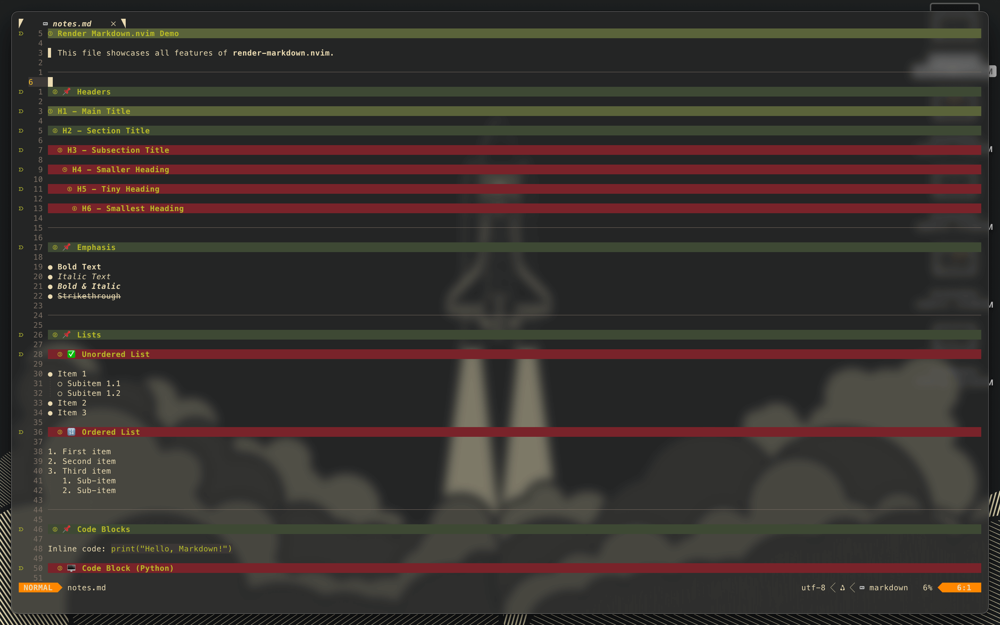
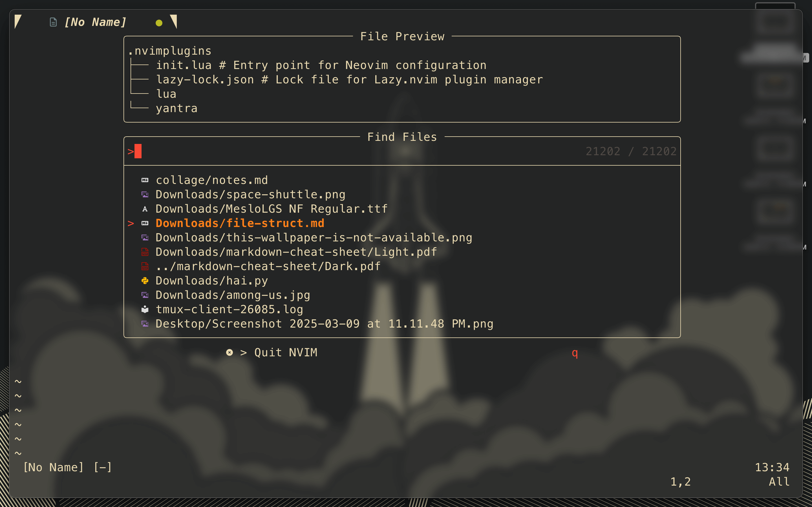
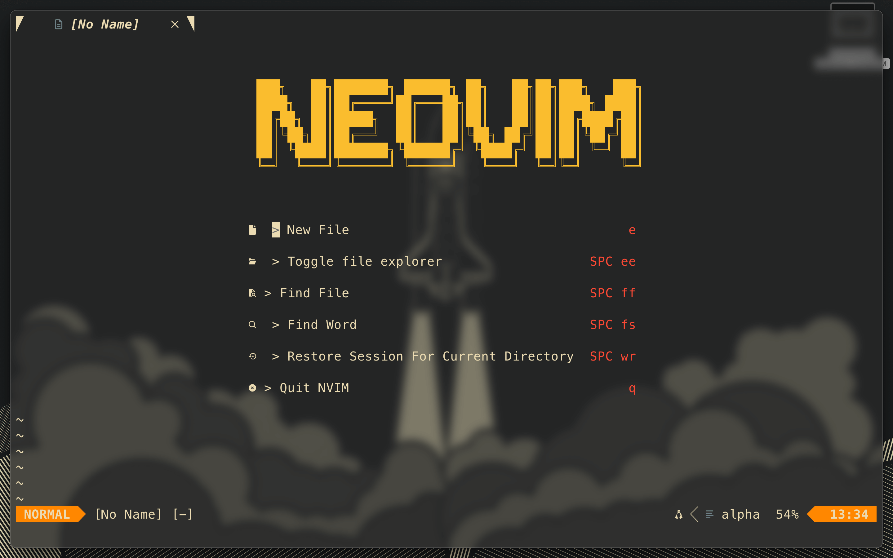
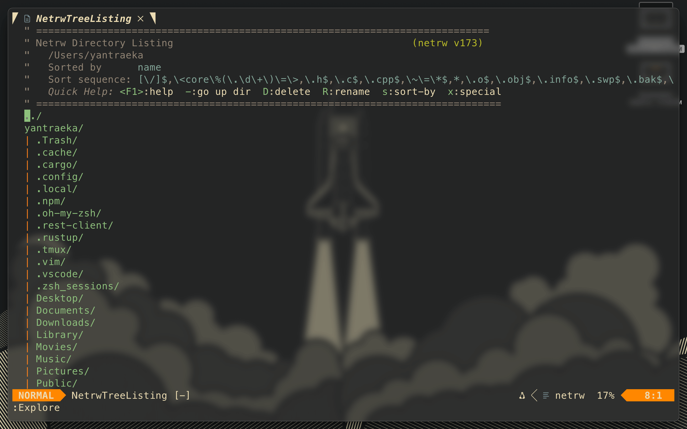

# 🚀 Yantra0011-Nvim: The Most Minimal & Productive Neovim Configuration  

Welcome to **Yantr-Nvim**, a **lightweight**, **blazingly fast**, and **highly customizable** Neovim setup.  
This configuration is designed for **power users**, **developers**, and **vim enthusiasts** who love efficiency.  

---

## 🎨 **Best Experience: Use a True Color Terminal**  

For the best visuals, **ensure your terminal supports true colors** (24-bit). Here are some recommended terminals:  

✅ **macOS** [🍎] : iTerm2, Kitty, Alacritty, WezTerm  
✅ **Linux** [🐧]: Kitty, Alacritty, WezTerm, Tilix  
✅ **Windows** [🪟]: Windows Terminal, WezTerm, Alacritty  

Check if your terminal supports **true color** with this command:  

```sh
nvim --version | grep term
```

---

## 📂 **File Structure**  

Here’s how the **Yantra0011-Nvim** files are structured:  

```
📦 yantr-nvim/
 ┣ 📂 lua/              # Main configuration
 ┃ ┣ 📂 core/          # Core settings
 ┃ ┃ ┣ 📜 init.lua     # Loads all configs
 ┃ ┃ ┣ 📜 options.lua  # Neovim settings
 ┃ ┃ ┣ 📜 keymaps.lua  # Custom keybindings
 ┃ ┃ ┣ 📜 lazy.lua     # Plugin manager setup
 ┃ ┣ 📂 plugins/       # Plugin configurations
 ┃ ┣ 📂 ui/            # UI settings (colors, statusline, etc.)
 ┣ 📜 init.lua         # Main entry point
 ┣ 📜 README.md        # Documentation
 ┗ 📜 .gitignore       # Ignore unnecessary files
```

🖼 **Visual Representation:**  
  

---

## ✨ **Features**  

🔥 **Super lightweight & optimized** – Only essential plugins  
⚡ **Lazy-loaded plugins** – No unnecessary startup delays  
🛠 **Intuitive keybindings** – Smooth and efficient workflow  
🔎 **Telescope integration** – Easy fuzzy finding  
📂 **File Explorer** – Navigate projects seamlessly  

---

## 📸 **Screenshots**  

### 📝 Markdown Notes  
  

### 🔍 Neovim Telescope  
  

### 📂 Neovim File Explorer  
  

### 🚀 Neovim Start Page  
  

### 🌲 Neovim Explorer  
  

---

## ⚙️ **Requirements**  

To get started, ensure you have the following installed:  

### 1️⃣ Install Neovim  
```sh
brew install neovim  # macOS
sudo apt install neovim  # Linux (Debian-based)
scoop install neovim  # Windows
```

### 2️⃣ Install Node.js (For Language Support)  
```sh
brew install node  # macOS
sudo apt install nodejs npm  # Linux
scoop install nodejs  # Windows
```

### 3️⃣ Install Ripgrep (For Telescope)  
```sh
brew install ripgrep  # macOS
sudo apt install ripgrep  # Linux
scoop install ripgrep  # Windows
```

### 4️⃣ Install Nerd Fonts (For Icons)  
Download a **Nerd Font** from [nerdfonts.com](https://www.nerdfonts.com/) and set it in your terminal.  

### 5️⃣ Install `tree` CLI (For File Structure)  
```sh
brew install tree  # macOS
sudo apt install tree  # Linux
scoop install tree  # Windows
```

### 6️⃣ Install `fzf` (For Fuzzy Searching)  
```sh
brew install fzf  # macOS
sudo apt install fzf  # Linux
scoop install fzf  # Windows
```

### 7️⃣ Install `bat` (Better `cat` Alternative)  
```sh
brew install bat  # macOS
sudo apt install bat  # Linux
scoop install bat  # Windows
```

---

## 📥 **Installation**  

Clone this repo and move it to your Neovim config folder:  

```sh
git clone https://github.com/yantra0011/yantr-nvim.git ~/.config/nvim
```

Then, open Neovim:  
```sh
nvim
```

Run **`:Lazy sync`** to install plugins.  

---

## 🔧 **Configuration Guide** (Based on Josean's Guide)  

### 📜 Set up `init.lua`
Create an **`init.lua`** file in your Neovim config:
```sh
mkdir -p ~/.config/nvim && touch ~/.config/nvim/init.lua
```

### 🔌 Install Plugin Manager (`Lazy.nvim`)
```lua
local lazypath = vim.fn.stdpath("data") .. "/lazy/lazy.nvim"
if not vim.loop.fs_stat(lazypath) then
  vim.fn.system({"git", "clone", "--filter=blob:none",
    "https://github.com/folke/lazy.nvim.git", lazypath})
end
vim.opt.rtp:prepend(lazypath)
```

### 🎨 Set Up Colorscheme
```lua
vim.cmd.colorscheme 'tokyonight-night'
```

### ⚡ Optimize Startup
```lua
vim.loader.enable()
```

### 🛠️ Install LSP Support
```lua
require'lspconfig'.tsserver.setup{}
```

### 🏎️ Enable Treesitter
```lua
require'nvim-treesitter.configs'.setup {
  ensure_installed = "all",
  highlight = { enable = true }
}
```

### 📜 Configure Keymaps
```lua
vim.keymap.set('n', '<C-p>', ':Telescope find_files<CR>')
```

---

## 🎬 **Inspired By**  
This setup is highly inspired by this awesome Neovim tutorial:  
🔗 [Watch Here](https://www.youtube.com/watch?v=6pAG3BHurdM&t=600s)  

🔗 Also based on [Josean's Neovim Guide](https://www.josean.com/posts/how-to-setup-neovim-2024)  

---

💡 **Enjoy a fast and efficient Neovim experience with Yantr-Nvim!** 🚀
